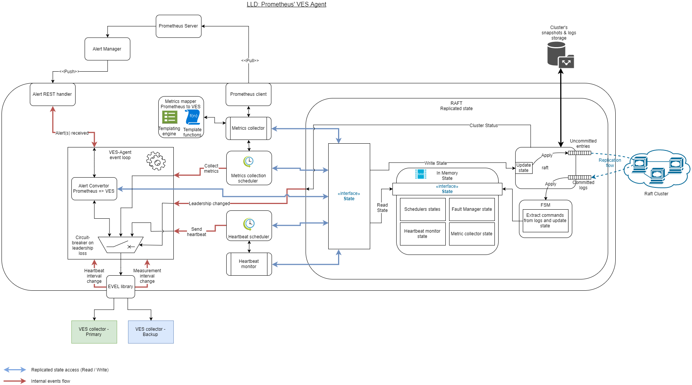
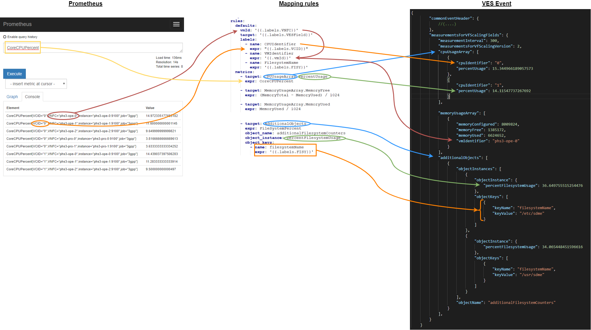

> **Important notice: The project is currently being imported into Github, and has a number of reworking in progress**

# VES-Agent
VES-Agent is a service acting as a bridge between prometheus and ONAP's VES-Collector.
It has 2 main roles :
* Act as a Webhook to Alertmanager, receives alerts, transform them to VES fault events and send them to VES collector
* Periodically query configured metrics from prometheus, map them into VES measurements event batch and send them to VES collector

VES-Agent can be deployed in standalone configuration, or can be clustered to enable high availability. High availability is implemented using Raft consensus which requires 3 or 5 nodes in order to get a reliable HA.

In high available configuration, 1 VES-Agent node is elected as a leader, while others are followers. Leadership is transfered as needed. Only the leader node will be able to process incoming alerts and metrics. It's also responsible from sending heartbeats to VES collector.
Only the leader node can update global replicated state while follower passively receive and apply updates. States snapshots and replication logs of each node are stored locally in filesystem.

The replicated state is assured to be consistent accross the cluster

## Architecture



### Event Loop
The VES-Agent's event loop is the main process goroutine where all the business logic happen. It waits on multiple input channels for an event to occure. When an event arrives, specific business logic is executed depending on its type and source. One event has to be considered differently: Raft cluster leadership change. This event is triggered when the process gain or loose cluster leadership, and is used as a circuit breaker for the event-loop. When process is not the leader, no business logic will happen.

#### Events
 * **Alert(s) received** : Sent from the Alertmanager REST webhook on alert notification reception (either a raise or clear). Contains one or more alerts in prometheus format. On reception, event loop will convert it into VES event and send it to collector, unless the process is not the leader in which case nothing will happen, and an error is returned to the Alertmanager
 * **Leadership change** : Sent from Raft cluster when the process gain or loose leadership. The event is used to circuit-break the eventloop
 * **Metric collection**: Sent from metric collection scheduler when it's time to collect a new batch of metrics
 * **Heartbeat monitor** : Sent from heartbeat scheduler when it's time to send a new heartbeat to VES collector
 * **Heartbeat interval change** : Sent from VES collector to change heartbeat interval. On reception, Heartbeat scheduler is reconfigured
 * **Measurement interval change** : Sent from VES collector to change measurements interval. On reception, metrics collection scheduler is reconfigured

### Global Replicated State
 The global state is kept replicated accross all nodes in the cluster using RAFT mechanisms.
 The current state is stored in memory, offering quick reading speed. All nodes, whatever their status is, can read the current state directly from memory. However writting to it is a privilege reserved to the leader node.

 The global replicated state consists of :
* Schedulers states (heartbeat + metrics)
    * Trigger interval
    * Time of next trigger (can be in the past, if trigger has been delayed or unsuccesful)
* Heartbeats state
    * Next event index
* Metrics state
    * Next event index
* Faults state
    * Next event index
    * Active faults
    * Sequence numbers for active faults

 Writes to the state are not directly applied to memory. Updates happen in 2 phases instead to replicate the state, and keep it consistent accross the cluster.
 1.  All the state mutations are converted into commands, encapsulated into a log, and sent to all nodes in the cluster. Other nodes will aknowledge the reception of the log. At that time, logs are not committed on any node, meaning that the state has not been updated yet. 
 2. Once the quorum is reached in nodes having received and aknowledged the log, the log is committed on all the nodes. It's send through a FSM which extracts the command from the log, and apply it to the in-memory state.

 Writes operations are synchronous, and returns only when the change has been committed accross the cluster.

 Logs are saved to disk and can be replayed in order to restore the state (for example after a restart). A node which is late after a restart will receive the missing logs from the leader to resynchronize with the cluster.

 In order to avoid large disk space usage and long resynchronization time, state is snapshotted regularly, and logs included in the snapshot are dismissed. Snapshots are also sent to nodes that need resynchronization.

 For more details about Raft consensus algorithm, have a look at this [Raft paper](https://raft.github.io/raft.pdf)

 A more gentle introduction is available on [The Secrete Lives Of Data](http://thesecretlivesofdata.com/raft/)

## Backup VES-collector
In case one event (heartbeat, metric or fault) cannot be sent to the VES collector, the ves-agent will switch to a second VES collector (if configured). All the next events will be sent to this new collector while available.

## Build
> Agent, simulator and govel library are tested using **Golang v1.11.5**, while other version may work. Your `GOPATH` variable must be set, and the `bin/` directory from it must be set in the `PATH` variable

1. If needed, setup `HTTP_PROXY` and `HTTPS_PROXY` environment variables
2. Download dependencies by running `go mod download`
3. Build agent with `go build ./ves-agent`
4. Build the simulator:
    1. Install **packr** by running `go get github.com/gobuffalo/packr/packr`
    2. Run `go generate ./...`
    3. Run compilation with `go build ./ves-simu`

Resulting executable binaries will be found in the current working dircetory
 * **ves-agent[.exe]** is the main executable used to run VES-Agent
 * **ves-simu[.exe]** is a VES collector simulator, mainly usedfor testing

## Unit testing
From repository root directory, run the command `go test -race ./...` to run all the unit tests

## Packaging

**[Goreleaser](https://goreleaser.com/)** is used to package the software for multiple targets.

1. Install **rpmbuild** using your distribution package manager
2. Install **goreleaser** by following [installation instructions](https://goreleaser.com/install/)
3. Run `goreleaser --snapshot`

Build artifacts will be located in `./dist/` directory.

## Configuring
Configuration of the ves-agent can be set by
* a configuration file in yml format: /etc/ves-agent/ves-agent.yml
* command line parameters, see ves-agent -h
* environment variables respecting the syntax VES_YAMLSECTION_NAME (all in upper case)

### Global configuration
Internal global configuration of the ves-agent.
```yaml
debug: true # Print ves-agent log entries
datadir: ./data # raft data directory
caCert: # root certificate content.
```

### VES Collectors
The VES-Agent's connection to VES collector is defined in the `primaryCollector` section of configuration file. The configuration for the backup collector is in the `backupCollector` section. Only the `primaryCollector` section is required.
Both sections specify how to connect to the collector (adress, port and topic) and the credentials to be used (user name and encrypted password with associated passphrase).  

```yaml
primaryCollector:
  fqdn: 135.117.116.201
  port: 8443
  topic: mytopic
  user: user
  password: U2FsdGVkX1/6lYKUMhpyz1IFBtgaE3MVwj2uoj+4PR8=
  passphrase: mypassphrase
backupCollector:
  fqdn: 135.117.116.202
  port: 8443
  topic: mytopic
  user: user
  password: U2FsdGVkX1/6lYKUMhpyz1IFBtgaE3MVwj2uoj+4PR8=
  passphrase: mypassphrase
```

### Event configuration
The event fields and timing information which are common to heartbearts, measurements and faults are configured in the `event` section of configuration file.

```yaml
event:
  vnfName: dpa2bhsxp5001v 
  # reportingEntityName: dpa2bhsxp5001vm001oam001 # host name of the VM where the ves-agent is running 
  reportingEntityID: 1af5bfa9-40b4-4522-b045-40e54f0310fc # UUID of the VM where the ves-agent is running, retrieved from the openstack metadata.
  maxSize: 2000000 # maximum size of an event
  nfNamingCode: hsxp # part of vnfName, respecting naming rules
  nfcNamingCodes: # mapping between VM names and naming code
    - type: oam # part of processing VM name, respecting naming rules
      vnfcs: [lr-ope-0,lr-ope-1,lr-ope-2] 
    - type: etl # part of OPE VM name, respecting naming rules
      vnfcs: [lr-pro-0,lr-pro-1] 
  retryInterval: 5s # interval to wait after a timeout before retrying to post the event
  maxMissed: 2 # nb of retry to send an event before switching to the second ves-collector
alertManager: 
 bind: localhost:9095 # listening address:port to receive alertManager events
```

### Measurements

Measurements are configured in the `measurement` section of configuration file.
This section specify how to connect to metric source (eg: prometheus), which metrics to query, and 
how to map them to a VES event

```yaml
measurement: 
  domainAbbreviation: Mvfs
  defaultInterval: 300s # Default interval between each meatric collection
  maxBufferingDuration: 1h # Max interval to retry
  prometheus: 
    address: http://localhost:9090 # URL to prometheus server
    timeout: 30s
    keepalive: 30s
    rules:
      defaults: <rule> # Default rules. All fields except "expr" can have a default value
      metrics: [<rule>, ...] # List of metrics querying rules (see next section)
```

#### Rules
A rule express how to fetch a metric from prometheus, and how to map it into a VES measurement event.
A rule has a set of mandatory parameters :
* **expr** : Prometheus query to fetch a metric
* **target** : Template expression giving the target field in the VES measurement event. For example `CPUUsageArray.Percent`
* **vmId** : Template expression giving the ID of the VM to use in measurement header
* **labels** : A list a key / values to be added in the target structure
    * _name_ : Key name
    * _expr_ : Template expression giving the value

If **target** has value `AdditionalObjects`, then a few additional fields are needed
* **object_name** : Template expression givig the value of `objectName` fiedl in `JSONObject` structure
* **object_instance**
* **object_keys**
    * _name_ : Key name
    * _expr_ : Template expression giving the key value

> **Template expressions** are based on [Golang's templates](https://golang.org/pkg/text/template/) implementing data-driven templates for generating textual outputs. During template evaluation, metrics labels are accessible (except for the `expr` parameter) under the `labels` key, eg: `{{.labels.MyLabelName}}`. The collection interval in seconds is available under the `interval` key. And the vm ID defined in `vmID` parameter is available under the `vmId` key. For available functions, see [Sprig libary documentation](http://masterminds.github.io/sprig/)

##### Example

```yaml
rules:
      defaults:
        vmId: '{{.labels.VNFC}}'
        target: '{{.labels.VESField}}'
        labels:
          - name: CPUIdentifier
            expr: "{{.labels.VCID}}"
          - name: VMIdentifier
            expr: '{{.vmId}}'
          - name: FilesystemName
            expr: '{{.labels.FISY}}'
      metrics:
        - target: MemoryUsageArray.MemoryFree
          expr: (MemoryTotal - MemoryUsed) / 1024

        - target: MemoryUsageArray.MemoryUsed
          expr: MemoryUsed / 1024

        - target: AdditionalObjects
          expr: FileSystemPercent
          object_name: additionalFilesystemCounters
          object_instance: percentFilesystemUsage
          object_keys:
            - name: filesystemName
              expr: '{{.labels.FISY}}'
```



### Heartbeat
Measurements are configured in the `heartbeat` section of configuration file.
This section only specify the default interval between 2 heartbeats.

```yaml
heartbeat:
  defaultInterval: 60s
```

### High Availability
Enabling clustering and high availability is done in the `cluster` section of configuration file.
Basically, the section contains the list of clustered nodes, with their IP:port, and their unbique ID. The local node's ID is needed too, identifying which of the nodes is the local one.

```yaml
cluster:
  debug: false # Print raft debug messages into logfile
  displayLogs: false # Print replication log entries
  id: "1" # ID of local node. Must be unique accross the cluster
  peers: # List of all the nodes in the cluster (local node included). This configuration must be the same on all the nodes
    - id: "1"
      address: "127.0.0.1:6737"
    - id: "2"
      address: "127.0.0.2:6737"
    - id: "3"
      address: "127.0.0.3:6737"
```

## Using the VES collector simulator
Please refer to [VES-Simulator documentation](./ves-simu/README.md)
